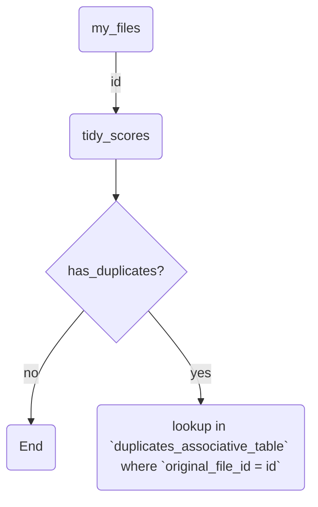

# MyFiles module

> This module is used to keep a reference to all the files that are managed by the tidybee-agent program.
> MyFiles tries to be database agnostic by abstracting the database access through the use of custom methods.

## How data is structured internally

Sqlite3 is used as the database backend. This is because it is a lightweight database that is easy to use and does not require a server to be running.

## Database structure

As of now, the database is composed as follows:

|Table Name| Purpose |
|----------|---------|
|my_files| Stores the files that are managed by the tidybee-agent program|
|tidy_scores| Stores the scores that are calculated for each file|
|duplicates_associative_table| Stores the duplicates that are found for each file|

### About `duplicate_associative_table`

This table was created to compensate the lack of feature in sqlite3 to store arrays. This table is used to store the duplicates that are found for each file. The table is composed of two columns: `original_file_id` and `duplicated_file_id`. The `original_file_id` column is a foreign key that references the `id` column of the `my_files` table. The `duplicated_file_id` column is a foreign key that references the `id` column of the `my_files` table. The `original_file_id` column is used to store the id of the file that is being checked for duplicates. The `duplicated_file_id` column is used to store the id of the file that is a duplicate of the file that is being checked for duplicates.

## Data fetching flow within the database (how it works internally)

> [!NOTE]
> This part of the documentation is more "MyFiles developer" oriented as it describes how the data is fetched from the database.

### Manipulating duplicates for a file

The way the duplicates are handled is as follows:

> [!NOTE]
> To reduce the lookup cost, it is important to set `tidy_scores.has_duplicates` to `true` when a duplicate is found for a file.